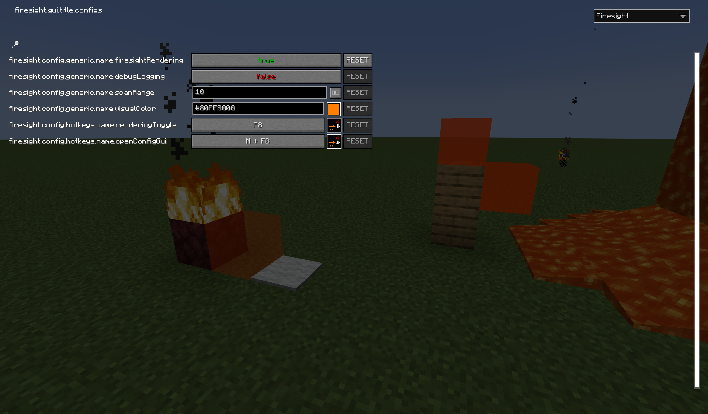

# Firesight Mod

Firesight is a Minecraft Fabric mod that provides visualization to help players understand fire spread mechanics in Minecraft. It uses MaLiLib and offers real-time block highlighting to show where fire can spread.

An air block will be highlighed if fire can spread to it. This works in a radius around the player that can be configured. Setting it to a high number does impact frames.

The visualisation can be turned off using a hotkey (default F8), and a settings menu can be opened using a hotkey (default M + F8).


It's my first mod. I am not responsible for killing your frames, although if you have so many places for the fire to spread that you get lag, you probably have bigger issues.

This mod was made by yelling at ChatGPT for two days and now "I made a mod". Feel free to edit this mod or "make your own", the license is pretty free.

## Development
To build Firesight locally, follow these steps:
```sh
git clone https://github.com/hekker-man/firesight.git
cd firesight
./gradlew build
```
- The mod jar file will be located in `build/libs`.
